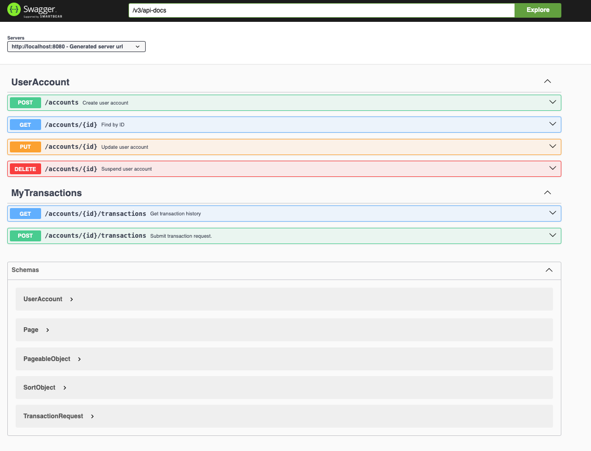

# User Accounts Application

This is the User Accounts application, a Spring Boot project designed to manage user transactions. The application leverages Spring WebFlux for reactive programming and integrates with a MySQL database.

## Prerequisites

- Java Development Kit (JDK) 21 or higher
- Gradle 8.10.2 or higher
- Docker (for running MySQL container)

## Building the Application

1. **Clone the Repository**

   Clone the repository to your local machine using the following command:

   ```bash
   git clone <repository-url>
    ```

2. **Navigate to the Project Directory** Change into the project directory:
    ```bash
    cd user-transactions
    ```

3. **Build the Application** Use Gradle to build the application:
    
    ```bash
    ./gradlew clean build
    ```
This command will compile the source code, run tests, and package the application into a JAR file.

## Running the Application

1. **Start the MySQL Database** Use Docker to start the MySQL database container. Ensure Docker is running and execute the following command:

    ```bash
   docker-compose -f compose.yaml up -d
    ```

2. **Run the Application** Start the Spring Boot application using the following command:
   ```bash
   java -jar ./build/libs/demo-app-<version>.jar
    ```

3. **Access the Application** Once the application is running, you can access it via[http://localhost:8080/swagger-ui.html](). The application name is configured as demo-app in `application.yaml.`
 
   


### API Endpoints

* **User Account Management:** The application provides endpoints for managing user accounts, including creating, updating, and suspending accounts.
* **Transaction Management:** Endpoints are available for handling transactions, including debit, credit, and rollback operations.

## Testing the Application
To run the tests, use the following Gradle command:

```bash
./gradlew test
```


This will execute the test cases defined in the src/test/java directory.

## Configuration
The application is configured using `application.yaml`. Key configurations include:

* **Database Connection:** Configured to connect to a MySQL database using R2DBC.
* **Logging:** Logging levels are set for various packages.
* **Spring Data Relational:** SQL initialization and R2DBC settings are configured for debugging and development purposes.

#### Additional Information
* **Swagger/OpenAPI:** The application uses Swagger for API documentation, as indicated by the `@OpenAPIDefinition` annotation in `UserAccountsApplication.java`.
* **Lombok:** The project uses Lombok for logging and reducing boilerplate code.
* **Reactive Programming:** Utilizes Spring WebFlux for non-blocking reactive programming.
For further details, refer to the source code and configuration files in the project directory.